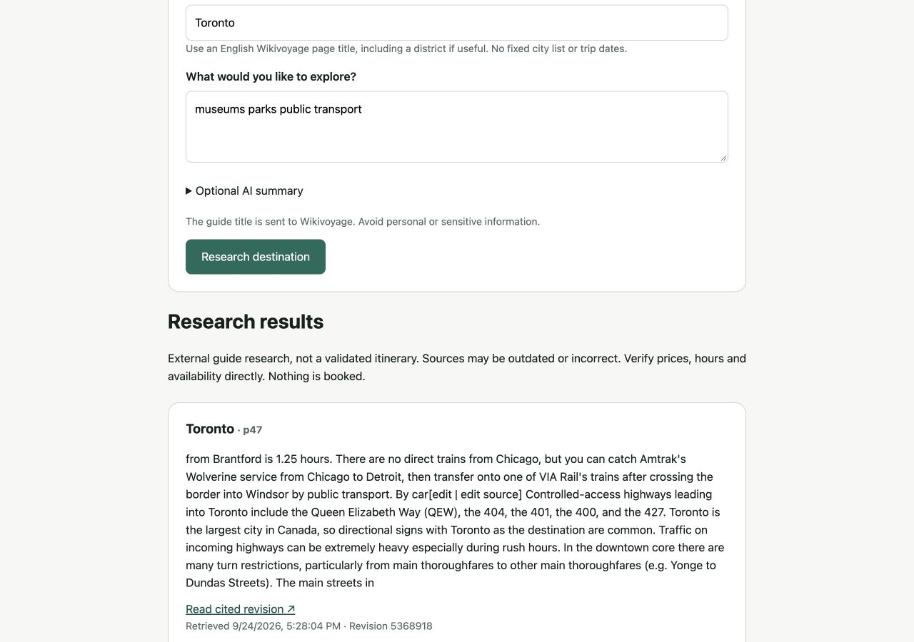
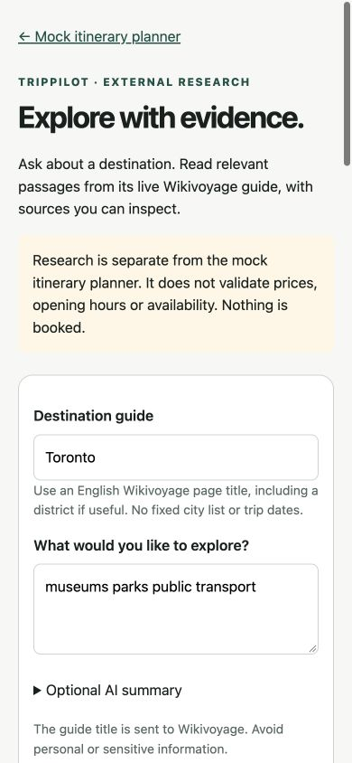

# External research: RAG and MCP

Approved by the user on September 24, 2026. This is a new research capability,
not a claim that the original mock itinerary planner now has live inventory.
The historical MVP's manual zoom gate remains open; the user explicitly chose
to start expansion without closing it.

## What works

- `/research` accepts an English Wikivoyage guide title and a question. There is
  no hardcoded city list or fixture-date restriction for research.
- `POST /api/v1/research` invokes `research_destination` through an official MCP
  SDK client and in-process protocol transport. The same server runs over stdio
  for external MCP hosts; this is not a fake tool dispatcher.
- The provider reads the live MediaWiki parse API, resolves wiki page redirects
  on the fixed origin, validates its JSON contract, and strips active markup.
- Request-local ingestion splits text into 120-word chunks with 20-word overlap.
  BM25 ranks chunks against question terms; zero-score chunks are excluded and
  at most four passages are returned. IDs, revision permalinks, UTC retrieval
  times, and CC BY-SA attribution accompany every excerpt.
- Optional Responses synthesis receives only the question and retrieved
  passages. Strict claims each require known citation IDs. Invalid output,
  timeout, refusal, missing configuration, or abstention preserves the evidence
  response. No retry or secondary model call occurs.

This is lexical RAG with optional generation, not vector search or an autonomous
agent. Evidence-only mode is explicitly labelled and does not pretend to be
LLM-generated prose. Citation membership is checked; semantic entailment is not
proven, so generated claims remain visibly unverified.

## Run locally

Install the backend with `python -m pip install -e './backend[dev]'`, then use
the existing README backend/frontend startup commands. Open `/research`.
An internet connection is required for research, but no API key is needed to
retrieve evidence. The original `/api/v1/itineraries/plan` remains offline.

Example request:

```bash
curl http://127.0.0.1:8000/api/v1/research \
  -H 'Content-Type: application/json' \
  -d '{"destination":"Toronto","question":"museums parks public transport","synthesize":false}'
```

For optional generated summaries, set server process variables
`TRIPPILOT_RESEARCH_GENERATION_ENABLED=true`, `TRIPPILOT_RESEARCH_MODEL` to a
Responses-compatible model available to the account, and `OPENAI_API_KEY`.
The server does not automatically load `.env`. Never place a key in browser
configuration. Generation additionally requires `synthesize: true` or the
unchecked-by-default UI checkbox. That checkbox explains data transmission and
possible cost. Model availability and paid quality evaluation are not claimed
by the offline tests.

## Connect an MCP host

Use the repository virtual environment and absolute paths on your machine:

```json
{
  "mcpServers": {
    "trippilot-research": {
      "command": "/ABSOLUTE/PATH/TripPilot/.venv/bin/python",
      "args": ["-m", "trippilot.research_mcp"]
    }
  }
}
```

The tool takes `{"request":{"destination":"Montreal","question":"parks",
"synthesize":false}}`. It returns the same typed response as the web API.
No external host configuration is changed automatically. Stdio does not expose
a listening network port. The web app uses in-process MCP transport rather than
spawning a process per HTTP request.

## Safety and bounds

Only `https://en.wikivoyage.org/w/api.php` is fetched for source content. User
input is encoded as a title parameter, never a URL. HTTP redirects and
environment proxy inheritance are disabled; wiki redirects stay inside the
same API. No crawling, link following, shell execution, remote MCP server
installation, account access, or booking tools exist.

Sources are limited to 1 MB decoded response data and 150,000 extracted
characters. Source stage: four-second absolute deadline. Optional generation:
four seconds, one request, 800 output tokens, 32 KiB response. The enclosing MCP
API has a nine-second deadline under existing ten-second middleware. Timeout
cancels async HTTP work. All exceptions become safe states, not raw provider
errors. Queries, snippets, keys, and model content are not intentionally logged
or persisted by the application; third-party service policies still apply.

Retrieved text and questions are untrusted. The model has no tools or access to
the planner, filesystem, keys, or arbitrary network endpoints. The application
renders plain text, not source HTML or model Markdown. Source links are fixed
origin revision URLs, and the frontend validates that origin too.

Research is public-local functionality, not a production service. Authentication,
multi-user quotas, concurrency/rate limiting, durable cache, vector indexing,
provider diversification, automated entailment evaluation, and paid model
benchmarks remain future work. Guide prose cannot establish live price,
availability, safety, or schedule guarantees. No retrieved record is inserted
into a validated itinerary.

## Dependencies and references

`mcp==2.2.0` supplies protocol negotiation, schemas, client, and stdio transport.
`httpx2` is promoted from the existing development dependency to runtime for
bounded cancellable HTTP; it is also required by the SDK. No vector database,
embedding service, orchestration framework, or persistence is required.

- [Official MCP SDK](https://py.sdk.modelcontextprotocol.io/get-started/first-steps/)
- [MediaWiki parse API](https://www.mediawiki.org/wiki/API:Parsing_wikitext)
- [OpenAI structured outputs](https://developers.openai.com/api/docs/guides/structured-outputs)

## Verification

Offline tests cover strict input, fixed-origin source requests, redirects,
oversized/malformed source data, script stripping, ranking/chunk caps, no-hit
abstention, generation opt-in, missing configuration, refusals, malformed output,
unknown citations, and safe evidence fallback. Integration tests exercise the
API through MCP and a real stdio subprocess handshake. Frontend tests cover
runtime guards, unsafe links, citation references, form submission, and errors.
Live read-only smoke checks use public guide titles only. No paid model call is
part of this implementation's verification.

September 24 verification: 392 backend tests and 62 frontend tests passed;
Ruff, Pyright, ESLint, TypeScript, Prettier and the production build passed.
Live browser requests retrieved Toronto revision `5368918` and Montreal revision
`5358582`, demonstrating research beyond the original fixture city/date range.
Results received keyboard focus. At 1280, 390 and 320 CSS pixels, page scroll
width equalled viewport width. Actual native-browser zoom remains untested.





The desktop screenshot contains reformatted Toronto guide text by
[Wikivoyage contributors](https://en.wikivoyage.org/w/index.php?oldid=5368918),
licensed [CC BY-SA 4.0](https://creativecommons.org/licenses/by-sa/4.0/).
Source excerpts and any derived summaries retain that attribution/license;
the application code is separate from third-party guide content.
