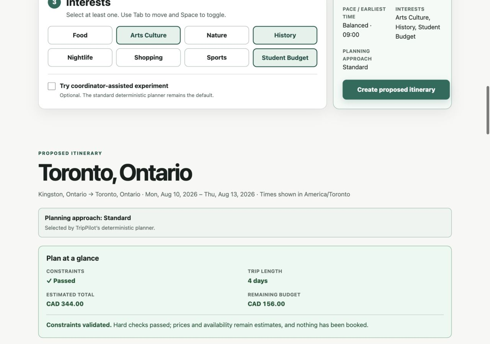
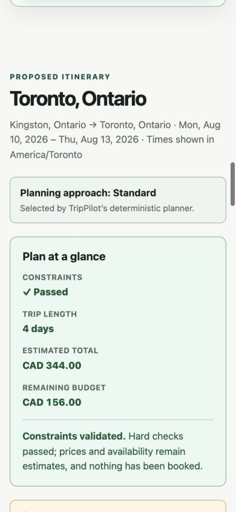

# Integrated MVP acceptance — September 23, 2026

Status: automated and browser functional checks pass; actual 200% browser zoom
remains an open completion gate. This is not a student usability study or a
production-readiness claim.

## Evaluated revision and integration

Evaluated code: `d4161b84213b1274e28fc2fa48754ca564ee16fd` on
`codex/mvp-final-acceptance`. Subsequent changes in this handoff are documentation
and screenshots only.

PR #6 merged into main before PR #7 merged into its former base branch,
`codex/mvp-demo-acceptance`. Therefore PR #7's offline core was not on main.
The evaluated merge combines main `3e92e79` with that base branch at `b8804b4`.
The final integration PR must target main.

## Automated checks

- Backend: 363 pytest cases passed; Ruff lint and formatting passed; Pyright
  reported zero errors and warnings.
- Frontend: clean install using npm 11.19.0 passed, with zero audit
  vulnerabilities; all 58 Vitest tests passed. ESLint, TypeScript, Prettier,
  and the production build passed.
- npm reported install-script policy warnings for esbuild, fsevents, and
  unrs-resolver. They did not fail installation or the build.

## Browser checks

Used a fresh production frontend on `127.0.0.1:3010` and fresh API on
`127.0.0.1:8010`, with the coordinator disabled and CORS allowing the frontend.
Build override: `NEXT_PUBLIC_TRIPPILOT_API_BASE_URL=http://127.0.0.1:8010`.
No hosted model calls or API keys were needed. Inputs follow `LOCAL_DEMO.md`.

| Scenario | Observed result |
| --- | --- |
| One day, August 10 | CAD 93.00 total; CAD 407.00 remaining |
| Two days, August 10–11 | CAD 193.00 total; CAD 307.00 remaining |
| Four days, August 10–13 | CAD 344.00 total; CAD 156.00 remaining |
| CAD 1 budget | Structured failure replaces successful proposal; displays CAD 1.00 |
| Restore CAD 500 | Successful four-day proposal returns; other inputs retained |
| Five days, August 10–14 | Linked inclusive-length validation error |
| Error link | Focus moves to the end-date control |
| Successful/failed API response | Result heading receives focus |
| Disclosures | Mock estimates and no-booking language visible |
| Desktop, 1280 px | No horizontal page overflow; readable summary |
| Mobile, 390 and 320 px | Page scroll width equals viewport width; result text wraps |

Screenshots were captured and visually inspected:

## Open gate: actual 200% browser zoom

The in-app browser did not change zoom in response to the native zoom shortcut.
Native Chrome control was blocked because macOS Computer Use permissions were
not granted. A resized viewport is not evidence of true browser zoom.

To close this gate, open the local demo in Chrome, set browser zoom to **200%**
through its menu, and run the four-day success, CAD 1 failure/recovery, and
five-day validation scenarios. Confirm labels, controls, errors, totals, and
disclosures remain readable and reachable without horizontal page scrolling.
Use Tab to reach controls and the date-error link. Record browser/version,
window size, observed results, and screenshots here; restore zoom afterward.
Fix and retest any blocker before marking the completion contract closed.

## Boundaries

Frozen synthetic Kingston–Toronto route and August 10–13 dates only. No current
availability, reservation, payment, deployment, or persistence. Hosted
coordination remains disabled by default. The offline agent foundation has no
public endpoint or proposal-revision capability. Expansion stays deferred until
the completion gate is closed and a separately scoped proposal is approved.
